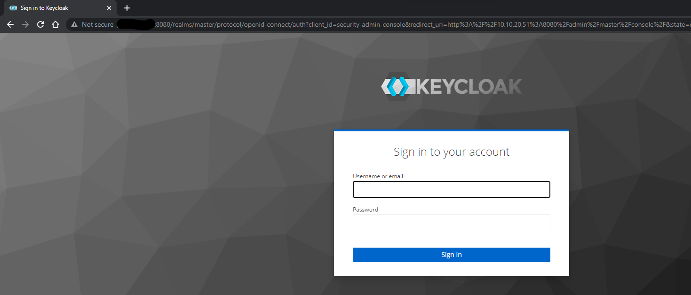
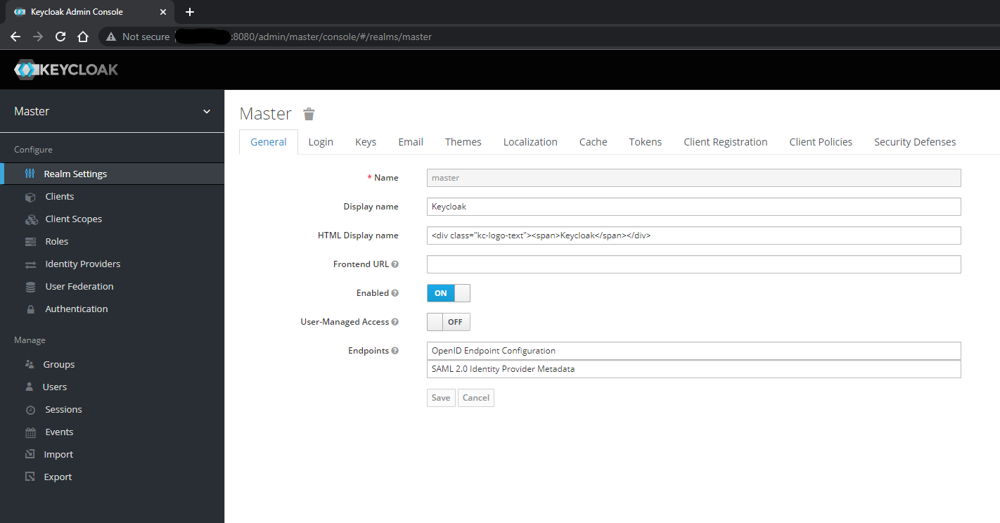

# keycloak-with-postgress

TOPIC

    Keycloak deployment with Postgres base on docker and docker compose.

	
HOW TO RUN
	
    Clone this Git and run:
    1. sudo chmod 744 requirements_deploy.sh
    2. sudo sh requirements_deploy.sh
    3. docker-compose up

Images
    

